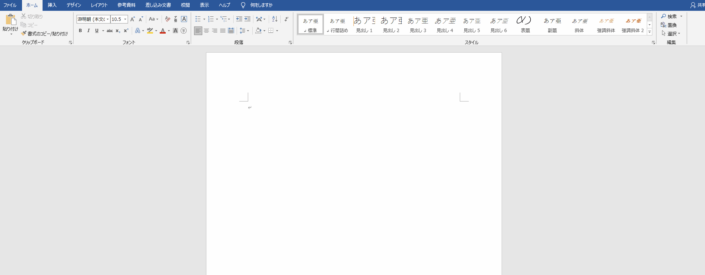
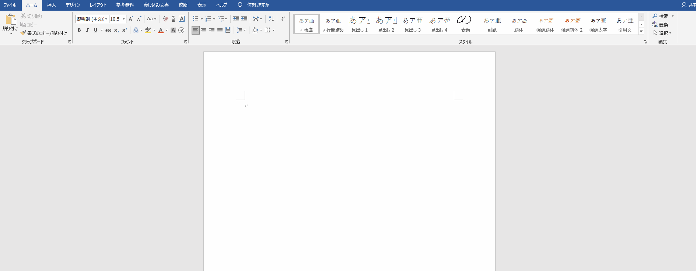

# Wordファイルの作成方法

## pタグの作成方法

特に編集等必要なく、テキストを入力する事で  
pタグを作成する事ができます

改行を行うと、別のpタグとして作成することができます

pタグ内で改行をしたい場合であれば、『Shift + Enter』で  
改行をすることができます

## h1 ~ h5 の作成方法

h1 ~ h5までは『ホーム』タブの右側で  
「見出し1」~「見出し5」で設定する事ができます

## リストの作成方法

リストは『ホーム』タブの左側『段落』の箇所で設定する事ができます  
空のリスト内で再度改行することで、リストを終了する事ができます

## テーブルの作成方法

テーブルは『挿入』タブの『表』をクリックすると  
作成することができます

